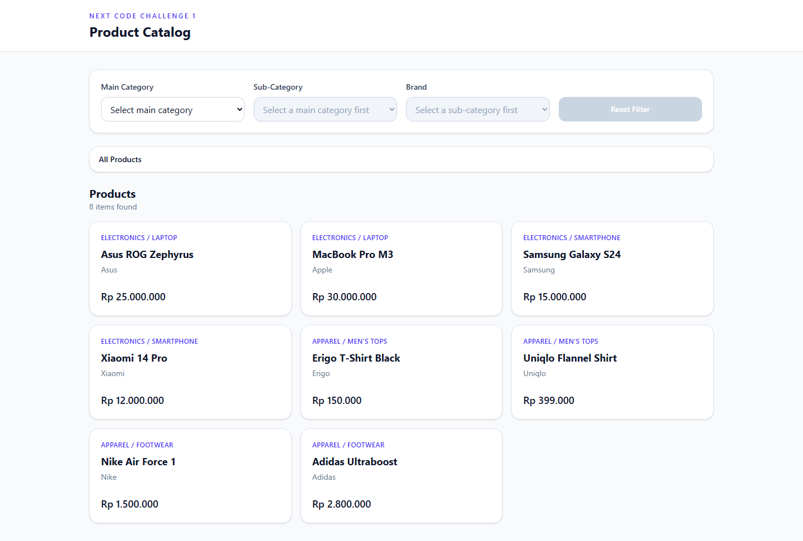
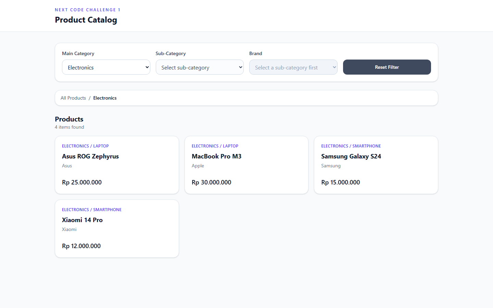
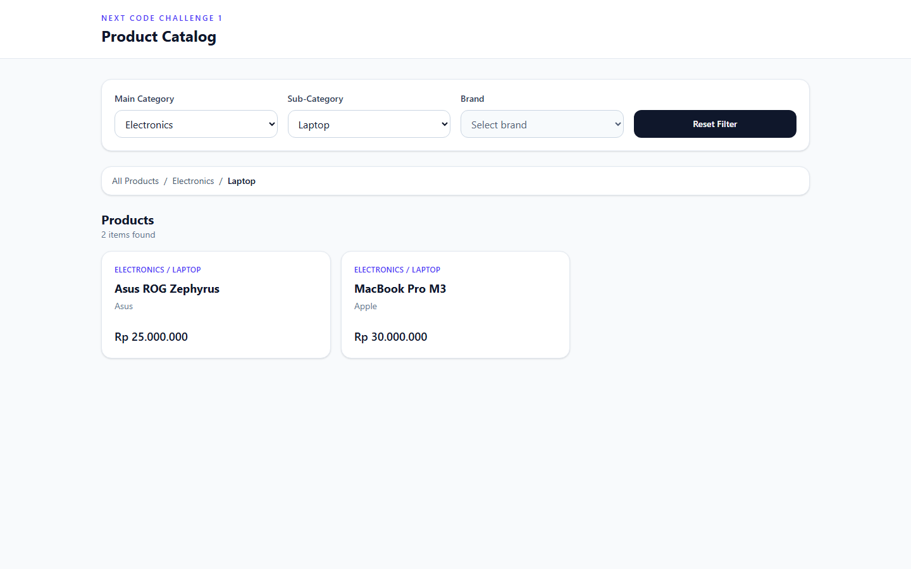
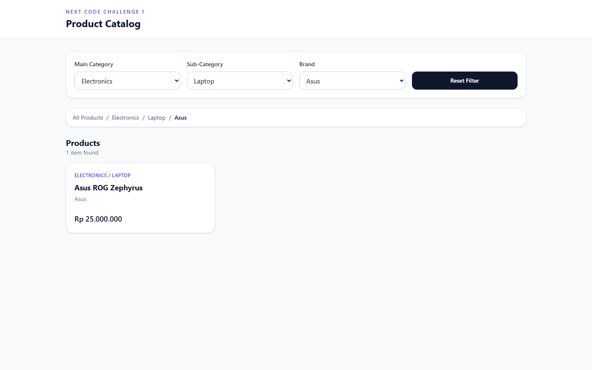

# NEXT Code Challenge 1

Dynamic e-commerce catalog with cascading dropdown filters, URL-based state, and Tailwind CSS.

Live source: [github.com/febrianrachmat/next-code-challenge-1](https://github.com/febrianrachmat/next-code-challenge-1)

## Getting started

```bash
npm install
npm run dev
```

Open `http://localhost:5173`.

## Problem-solving approach

The main risk in this challenge is keeping three dependent filters, the breadcrumb, and the product list in sync — including after a browser refresh. I treated the URL as the single source of truth instead of local component state.

1. **Load catalog data once** through React Router's Data API (`createBrowserRouter` + `loader`). The page never imports JSON directly.
2. **Store filter IDs in search params**: `?category=C1&subcategory=S1&brand=B1`.
3. **Derive everything else** from those params: enabled dropdowns, option lists, breadcrumb crumbs, and filtered products.
4. **Reset by clearing the URL**. That returns the UI to the initial state without extra reset logic in each component.

This avoids Redux/Zustand/form libraries and keeps refresh behavior free: if the URL still has the params, the UI restores itself.

## Step-by-step explanation

### 1. Project setup

Vite + React is the app shell. Tailwind CSS handles styling. React Router DOM is configured with `createBrowserRouter` so routing and data loading use the Data API.

### 2. Dummy data and loader

Catalog JSON lives in `src/data/catalog.json`. `catalogLoader` waits briefly to simulate a network request, then returns categories, sub-categories, brands, and products. The home route uses this loader.

### 3. Cascading filters

On first load, only **Main Category** has options. **Sub-Category** and **Brand** stay empty and disabled.

- Selecting a category writes `category` to the URL, enables sub-category, and clears brand.
- Selecting a sub-category writes `subcategory`, enables brand, and clears the previous brand.
- Selecting a brand writes `brand`.

The required `name` attributes are `category`, `subcategory`, and `brand`.

### 4. Breadcrumb and product list

`ProductBreadcrumb` uses `class="product-breadcrumb"` and `aria-label="breadcrumb"`. It grows as filters are applied, for example:

`All Products / Electronics / Laptop / Asus`

The product list is wrapped in a semantic `<section>`. Products are filtered by walking `product → brand → sub-category → category`, so a category-only filter still shows every matching item.

### 5. Reset and persistence

**Reset Filter** clears the search params. After refresh, React Router reads the same URL and rebuilds the selected filters, so the UI does not lose state.

## Architecture

```text
src/
  data/catalog.json              # dummy catalog
  loaders/catalogLoader.js       # simulated fetch via React Router loader
  utils/catalog.js               # filter derivation and product matching
  components/FilterBar.jsx       # cascading selects + reset
  components/ProductBreadcrumb.jsx
  components/ProductGrid.jsx
  pages/CatalogPage.jsx          # composes loader data + URL state
  router.jsx                     # createBrowserRouter
  main.jsx
```

No external state-management or form libraries are used. Filter updates go through `useSearchParams`.

## Screenshots

### Initial state

Only Main Category is populated. Sub-Category and Brand are disabled. All 8 products are shown.



### Main category selected

Choosing **Electronics** enables Sub-Category and filters the grid to 4 products.



### Sub-category selected

Choosing **Laptop** enables Brand and leaves 2 products.



### Brand selected

Choosing **Asus** updates the breadcrumb and shows 1 product. The URL stays in sync, so refresh keeps this view.



## Requirements checklist

- React Router Data API (`createBrowserRouter`, `loader`)
- Tailwind CSS only for styling
- No Redux, Zustand, or React Hook Form
- Cascading category → sub-category → brand
- Select `name` attributes: `category`, `subcategory`, `brand`
- Breadcrumb wrapper: `product-breadcrumb` + `aria-label="breadcrumb"`
- Product list wrapped in `<section>`
- Filter state persisted in URL search params
- Reset Filter returns to the initial catalog state
